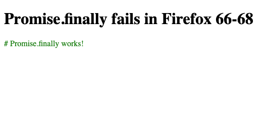
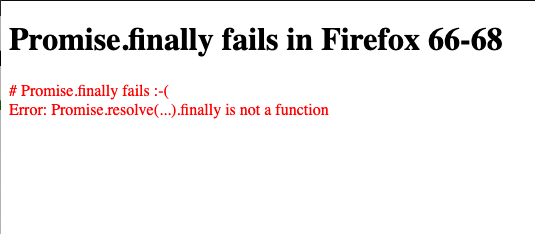

# ExcelJS `Promise.resolve(...).finally is not a function` error in Firefox 66-68
This repo is created for demonstrating the `TypeError: "Promise.resolve(...).finally is not a function"` error in Firefox 66-68 when using `ExcelJS`.

## Installation
In order to install the packages you need to run:
```bash
$ npm install
```

## Start
In order to start in developer mode you need to run:
```bash
$ npm start
```

## Chrome / Firefox 69+
In Chrome and Firefox 69+ you should see the message `# Promise.finally works!` in green color printed.



## Firefox 66-68
In Firefox 66-68 you should see the message `# Promise.finally fails :-(
Error: Promise.resolve(...).finally is not a function` in red color printed.



**NOTE:** if you comment out line 6 (`import ExcelJS from 'exceljs';`) it works in Firefox 66-68

## License
MIT
